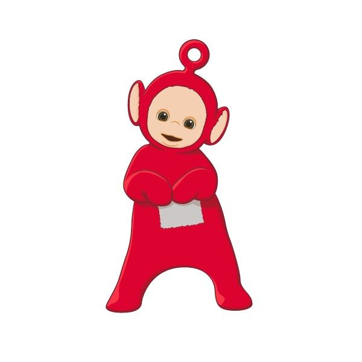
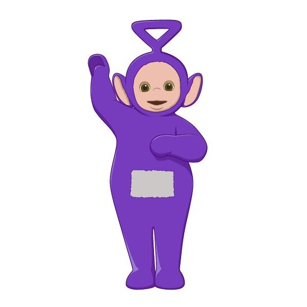
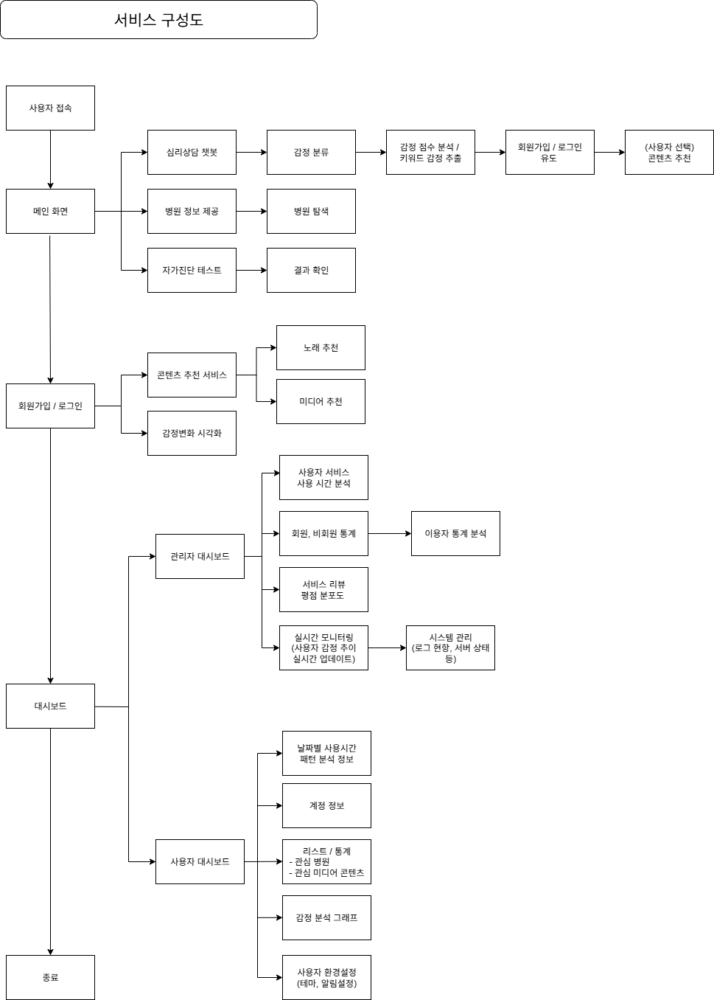
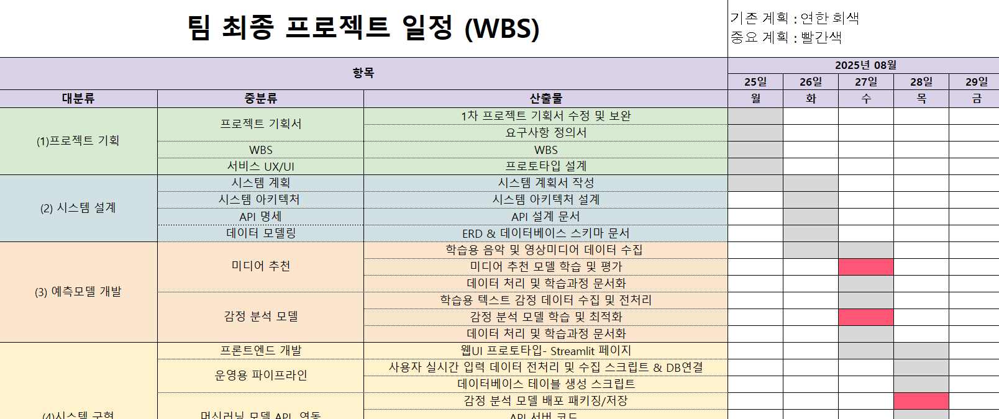

# 츄!러스 미: 공감 기반 심리 케어 AI 서비스

LG U+ Why Not SW Camp 7기 피사모 프로젝트의 첫 번째 레포지토리입니다.

## 1. 팀원 소개

<table>
  <tr>
    <th>김지희</th>
    <th>배형진</th>
    <th>김다은</th>
    <th>이은영</th>
  </tr>
  <tr>
    <td></td>
    <td></td>
    <td></td>
    <td></td>
  </tr>
  <tr>
    <td>팀장</td>
    <td>발표자</td>
    <td>리서처</td>
    <td>기록자</td>
  </tr>
  <tr>
    <td>
      
    </td>
    <td>
      
    </td>
    <td>
      
    </td>
    <td>
      
    </td>
  </tr>
</table>

---
## 2. 프로젝트 기획
🔗 **상세 기획서 바로가기:** [프로젝트 기획서](2프로젝트_산출물/2차프로젝트_기획서.docx)

### 2-1. 프로젝트 개요
1. **주제 :**
공감 기반 심리 케어 AI 서비스

2. **문제 정의 :** 많은 사람이 심리적 어려움을 겪지만, 기존 AI의 피상적인 답변에 한계를 느낍니다. 우리는 정서적 니즈를 충족시키는 AI를 개발하여 이 문제를 해결하고자 합니다.

3. **목표 :** 사용자의 감정 상태를 정교하게 파악하고, 이에 기반한 맞춤형 대화와 감정 관리 솔루션을 제공하는 '공감 기반 심리 케어 AI' 서비스를 개발합니다. 사용자가 자신의 감정을 깊이 탐색하고 스스로 해결책을 찾을 수 있도록 돕는 것이 이 서비스의 최종 목표입니다.

    (1) 정확한 감정 분석 및 공감적 대화로 심리적 안정감 제공

    (2) 맞춤형 감정 관리 솔루션으로 긍정적인 행동 변화 유도

    (3) 신뢰할 수 있는 심리적 파트너로서의 서비스 구축

### 2-2. 주요 기능 및 기대 효과
1. **주요 기능**

    (1) 공감 기반 대화: 사용자의 감정을 분석하여 깊이 있는 공감과 맞춤형 대화를 제공합니다.

    (2) 감정 분석 리포트: 사용자가 자신의 감정 패턴을 시각적으로 이해할 수 있도록 주간/월간 리포트를 제공합니다.

    (3) 맞춤형 콘텐츠 추천: 사용자의 현재 감정 상태에 맞는 음악, 영화, 드라마 등 미디어 콘텐츠를 추천하여 감정 이완 및 전환을 돕습니다.

    (4) 실시간 의료 서비스 연동: 사용자의 위치를 기반으로 심리 상담소, 병원 등 전문가 도움을 받을 수 있는 정보를 추천합니다.

2. **기대 효과**

    (1) 심리 케어 접근성 향상: 시간과 비용에 구애받지 않고 언제든 자신의 감정을 돌볼 수 있게 됩니다.

    (2) 정서적 안정 증진: 피상적인 답변이 아닌 깊이 있는 공감을 통해 사용자의 심리적 안정감을 높입니다.

    (3) 자기 이해 및 문제 해결 능력 향상: 감정 분석 리포트와 가이드라인을 통해 사용자가 스스로 문제를 해결할 힘을 기르게 됩니다.

    (4) 전문 서비스 연계: 단순한 대화형 AI를 넘어, 필요시 전문가의 도움을 받을 수 있는 실질적인 연결 고리를 제공합니다.

---

### 2-2. 프로젝트 기획서 다이어그램

서비스 구성도

  

  

시스템 흐름도

  

  

UI

 <tr>
    <td></td>
    <td></td>
    <td></td>
  </tr>
    
 

 
  ---

# 3. 작업 분할 구조 (WBS)

 
 
🔗 **WBS 바로가기:** [WBS](2프로젝트_산출물/2차프로젝트_WBS(산출물).xlsx)

  ------------------------------

# 4. 요구사항 정의 -> 수정필요

🔗 **요구사항 정의서 바로가기:** [요구사항 정의서.docs](https://github.com/whynotsw-camp/wh07-1st-Pisamo/blob/main/%EC%9A%94%EA%B5%AC%EC%82%AC%ED%95%AD%20%EC%A0%95%EC%9D%98%EC%84%9C.pdf)

----------------------------

# 5. 프로젝트 발표 및 프로토타입 -> 수정필요

  
🔗 **1차 프로젝트 ppt 바로가기:** [2차프로젝트 발표.pptx]()
  

## 프로토타입 구동 영상 (GPT-api 연동) -> 수정필요

   
